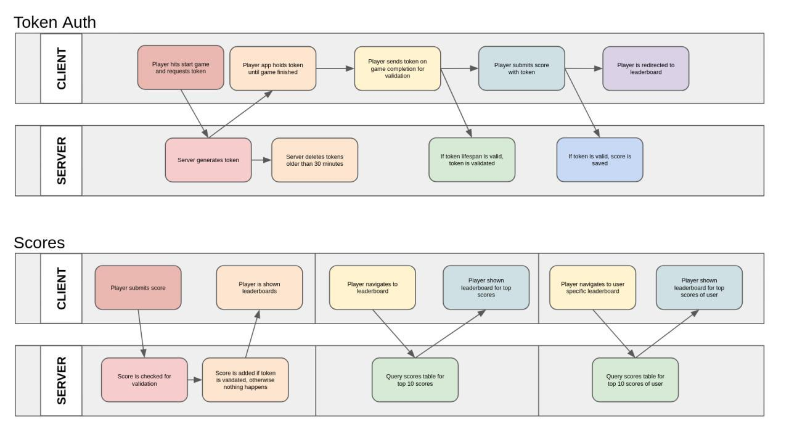

# WHACK-A-MOLE 3D - SERVER
***Made by Richard Folea***
___
***[Live Demo](https://aelof3.github.io/wam/)***
___

## Client server communication:  
  
___
## API Endpoints:  
___
## /scores
**REQUEST:** 
    `GET /scores`  
  
**RESPONSE:** 
```js
    [
        {
            "score_id":49,
            "user_name":"Raul",
            "score":93
        },
        {
            "score_id":4,
            "user_name":"LIGHTNING MCQUEEN",
            "score":99
        },
        {
            "score_id":5,
            "user_name":"Stinky pete",
            "score":99
        },
        {
            "score_id":6,
            "user_name":"Almost",
            "score":106
        },
        {
            "score_id":16,
            "user_name":"Tyler",
            "score":109
        },
        {
            "score_id":50,
            "user_name":"dusty chinchilla",
            "score":115
        }
    ]
```
**REQUEST:** 
`POST /scores`  
*with valid request, score is added to database*  
**REQUEST BODY:** 
```js
    {
        "user_name":"Raul",
        "score":93,
        "authtoken":"229a-24124d-s2323i-asd33"
    }
```
___
## /scores/:userid
**REQUEST:** 
`GET /scores/:Raul`
**RESPONSE:** 
```js
    [
        {
            "score_id":49,
            "user_name":"Raul",
            "score":93
        }
    ]
```
___
## /auth
**REQUEST:** 
`GET /auth`
**RESPONSE:** 
```js
    {
        "authtoken":"229a-24124d-s2323i-asd33",
    }
```
**REQUEST:** 
`POST /auth`  
*with valid request, token is validated and can be used to submit one score matching the score in the request*  
**REQUEST BODY:** 
```js
    {
        "points":100, // points will always be 100
        "score":93,
        "authtoken":"229a-24124d-s2323i-asd33"
    }
```